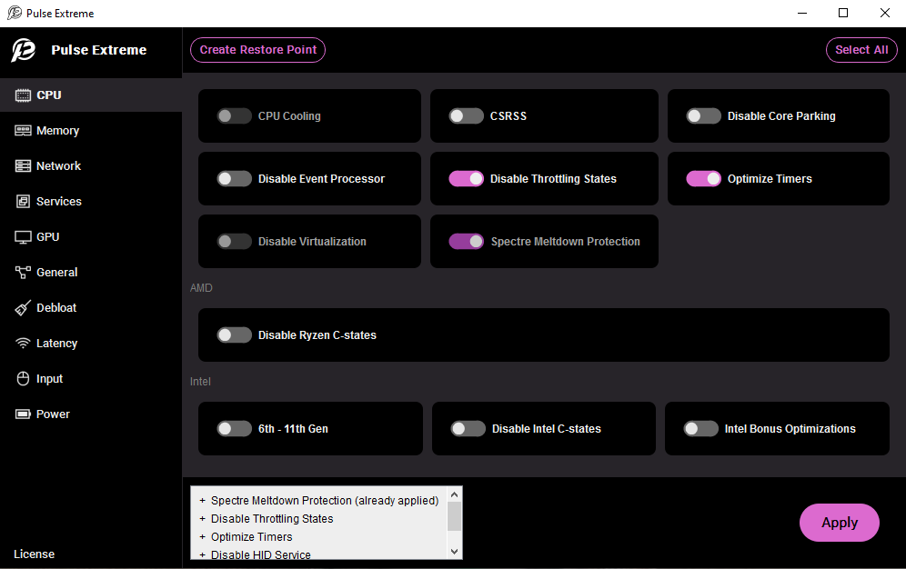
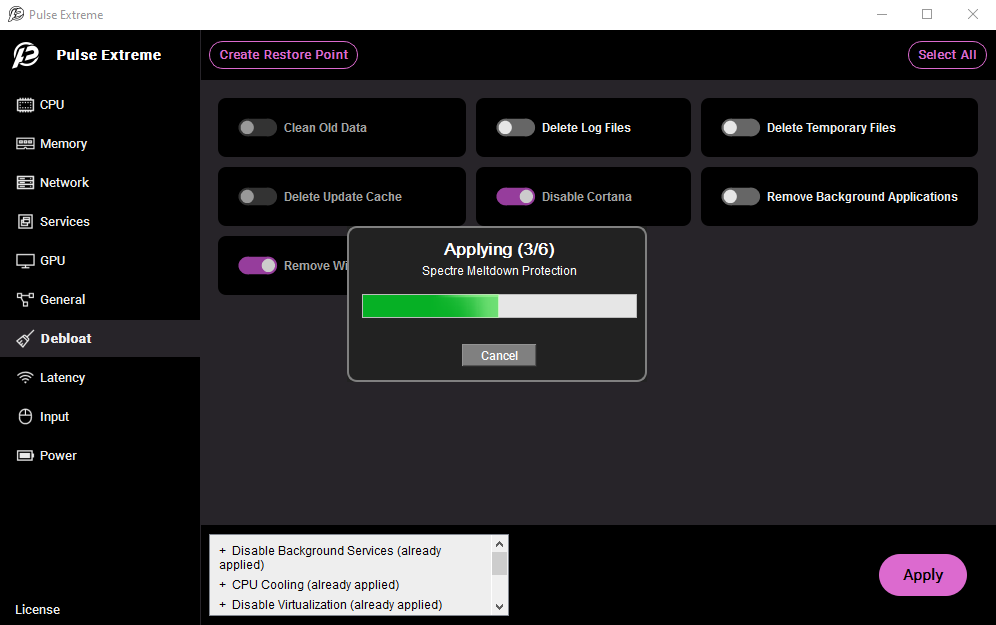

# Pulse Extreme
### An optimization utility for Windows 10 & 11 built with Python and PySide6

Pulse Extreme is designed for gamers and power users seeking to reduce system latency, increase performance, and reduce Windows bloat.
This tool provides a simple interface that allows users to toggle advanced system tweaks at the click of a button.
The batch files used by the program are not included in this repo. 

### Screenshots

